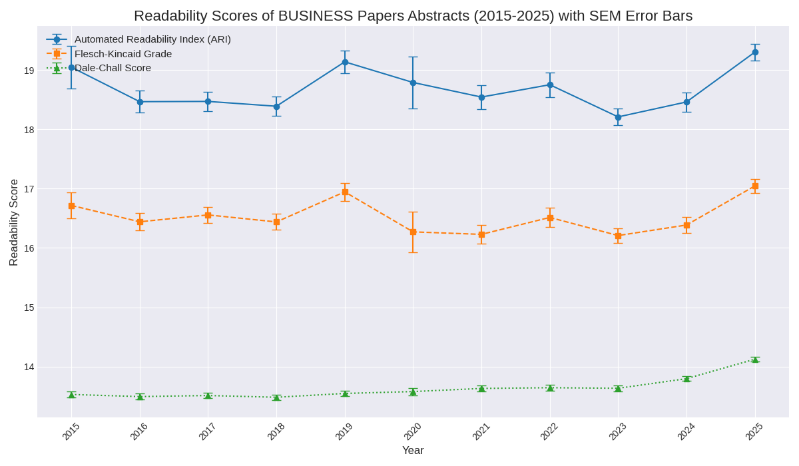
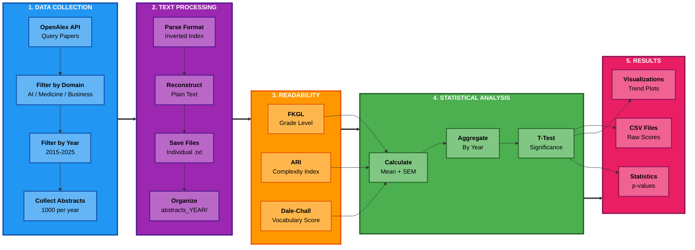

# Do LLM's Affect Readability of Scientific Writing?

This study investigates whether LLM's AI-Tools correlate with measurable changes in readability across peer-reviewed scientific literature from 2015 to 2025.

## Project Overview

Using the OpenAlex API, we compiled 33,000 abstracts published between 2015 and 2025 across three domains: Artificial Intelligence, Medicine, and Business. Readability was assessed using three established formulas: Flesch-Kincaid Grade Level (FKGL), Automated Readability Index (ARI), and Dale-Chall.




Key findings indicate that the AI domain shows a consistent rise in complexity that sharply accelerates after 2022, whereas the Medicine and Business domains show high year-to-year volatility before converging in an upward spike in 2023-2025. Statistical significance appears primarily from 2024 onwards when comparing to 2018 baseline.

## Repository Structure

The repository is organized as follows:

- **data/**: Contains raw readability scores in CSV format for all three domains
- **figures/**: Visualization outputs showing readability trends with SEM error bars
- **AI/**, **MEDICINE/**, **BUSINESS/**: Domain-specific abstracts organized by year
- **readability_analysis.ipynb**: Jupyter notebook for complete analysis pipeline (Google Colab ready)
- **methodology_flowchart.md**: Visual representation of the data processing workflow
- **requirements.txt**: Required Python packages

## Installation

Clone the repository:

```bash
git clone https://github.com/lydiakrifka/llm-readability-scientific-abstract.git
cd llm-readability-scientific-abstract
```

Install the required packages:

```bash
pip install -r requirements.txt
```

## Usage

**Using Jupyter Notebook (Recommended):**

Open `readability_analysis.ipynb` in Jupyter or Google Colab and follow the step-by-step analysis.

**Using Python Scripts:**

1. Fetch abstracts from OpenAlex:

```bash
python openalex_fetcher.py
```

2. Calculate readability scores:

```bash
python readability_analyzer.py
```

3. Compare specific years:

```bash
python statistical_comparison.py
```

## Methodology



**Data Collection:** OpenAlex API, 1,000 abstracts per year per domain (2015-2025), total corpus of 33,000 abstracts.

**Readability Metrics:**

- Flesch-Kincaid Grade Level (FKGL): Measures years of education needed
- Automated Readability Index (ARI): Character-based complexity measure
- Dale-Chall Formula: Vocabulary familiarity assessment

**Statistical Analysis:** Welch's independent two-sample t-test, significance level α = 0.05, error bars show Standard Error of Mean (SEM).

## Results

Statistical significance comparing 2018 to subsequent years:

| Comparison   | ARI p-value | FKGL p-value | Dale-Chall p-value | Significant? |
| ------------ | ----------- | ------------ | ------------------ | ------------ |
| 2018 vs 2019 | 0.6634      | 0.4753       | 0.9930             | No           |
| 2018 vs 2022 | 0.6591      | 0.6787       | 0.6481             | No           |
| 2018 vs 2023 | 0.9641      | 0.4895       | 0.3064             | No           |
| 2018 vs 2024 | 0.0419      | 0.0390       | 0.000009           | Yes          |

Statistical significance only appears when comparing 2024 to 2018, confirming measurable impact on readability starting from 2024.

## License

This project is licensed under the GNU General Public License v3.0 - see the [LICENSE](LICENSE) file for details.

## Contributors

- Daniel Duhnev - UPF Barcelona
- Marcelo Jimenez - UPF Barcelona
- Lydia Krifka-Dobes - UPF Barcelona

Contact: daniel.duhnev01@estudiant.upf.edu, marceloenrique.jimenez01@estudiant.upf.edu, lydia.krifka01@estudiant.upf.edu

## Acknowledgments

OpenAlex API for open access to scholarly metadata, textstat library for readability implementations, Prof. Davinia Hernández-Leo (UPF) for supervision.
