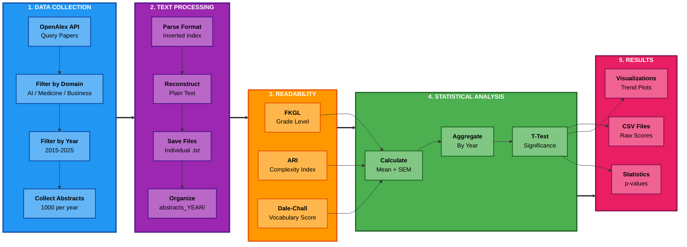

```mermaid
flowchart LR
    subgraph Step1["<b>1. DATA COLLECTION</b>"]
        A1["<b>OpenAlex API</b><br/>Query Papers"]
        A2["<b>Filter by Domain</b><br/>AI / Medicine / Business"]
        A3["<b>Filter by Year</b><br/>2015-2025"]
        A4["<b>Collect Abstracts</b><br/>1000 per year"]
    end

    subgraph Step2["<b>2. TEXT PROCESSING</b>"]
        B1["<b>Parse Format</b><br/>Inverted Index"]
        B2["<b>Reconstruct</b><br/>Plain Text"]
        B3["<b>Save Files</b><br/>Individual .txt"]
        B4["<b>Organize</b><br/>abstracts_YEAR/"]
    end

    subgraph Step3["<b>3. READABILITY</b>"]
        C1["<b>FKGL</b><br/>Grade Level"]
        C2["<b>ARI</b><br/>Complexity Index"]
        C3["<b>Dale-Chall</b><br/>Vocabulary Score"]
    end

    subgraph Step4["<b>4. STATISTICAL ANALYSIS</b>"]
        D1["<b>Calculate</b><br/>Mean + SEM"]
        D2["<b>Aggregate</b><br/>By Year"]
        D3["<b>T-Test</b><br/>Significance"]
    end

    subgraph Step5["<b>5. RESULTS</b>"]
        E1["<b>CSV Files</b><br/>Raw Scores"]
        E2["<b>Visualizations</b><br/>Trend Plots"]
        E3["<b>Statistics</b><br/>p-values"]
    end

    Step1 ==> Step2
    Step2 ==> Step3
    Step3 ==> Step4
    Step4 ==> Step5

    A1 --> A2
    A2 --> A3
    A3 --> A4

    B1 --> B2
    B2 --> B3
    B3 --> B4

    C1 --> D1
    C2 --> D1
    C3 --> D1

    D1 --> D2
    D2 --> D3

    D3 --> E1
    D3 --> E2
    D3 --> E3

    style Step1 fill:#2196F3,stroke:#0D47A1,stroke-width:3px,color:#fff
    style Step2 fill:#9C27B0,stroke:#4A148C,stroke-width:3px,color:#fff
    style Step3 fill:#FF9800,stroke:#E65100,stroke-width:3px,color:#fff
    style Step4 fill:#4CAF50,stroke:#1B5E20,stroke-width:3px,color:#fff
    style Step5 fill:#E91E63,stroke:#880E4F,stroke-width:3px,color:#fff

    style A1 fill:#64B5F6,stroke:#0D47A1,stroke-width:2px,color:#000
    style A2 fill:#64B5F6,stroke:#0D47A1,stroke-width:2px,color:#000
    style A3 fill:#64B5F6,stroke:#0D47A1,stroke-width:2px,color:#000
    style A4 fill:#64B5F6,stroke:#0D47A1,stroke-width:2px,color:#000

    style B1 fill:#BA68C8,stroke:#4A148C,stroke-width:2px,color:#000
    style B2 fill:#BA68C8,stroke:#4A148C,stroke-width:2px,color:#000
    style B3 fill:#BA68C8,stroke:#4A148C,stroke-width:2px,color:#000
    style B4 fill:#BA68C8,stroke:#4A148C,stroke-width:2px,color:#000

    style C1 fill:#FFB74D,stroke:#E65100,stroke-width:2px,color:#000
    style C2 fill:#FFB74D,stroke:#E65100,stroke-width:2px,color:#000
    style C3 fill:#FFB74D,stroke:#E65100,stroke-width:2px,color:#000

    style D1 fill:#81C784,stroke:#1B5E20,stroke-width:2px,color:#000
    style D2 fill:#81C784,stroke:#1B5E20,stroke-width:2px,color:#000
    style D3 fill:#81C784,stroke:#1B5E20,stroke-width:2px,color:#000

    style E1 fill:#F06292,stroke:#880E4F,stroke-width:2px,color:#000
    style E2 fill:#F06292,stroke:#880E4F,stroke-width:2px,color:#000
    style E3 fill:#F06292,stroke:#880E4F,stroke-width:2px,color:#000
```
