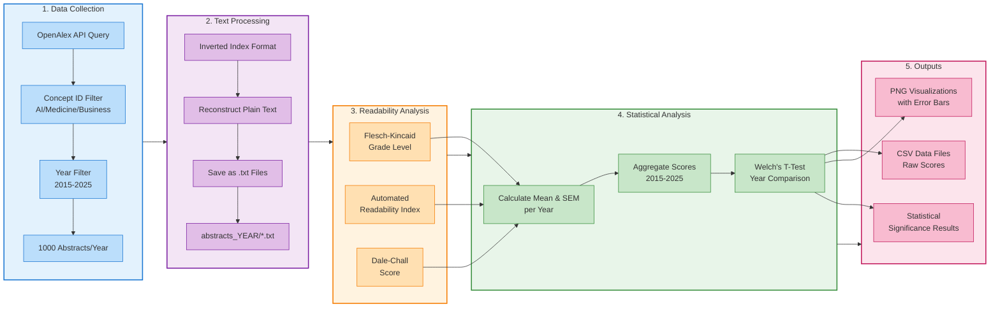

```mermaid
flowchart LR
    subgraph Step1["1. Data Collection"]
        A1[OpenAlex API Query]
        A2[Concept ID Filter<br/>AI/Medicine/Business]
        A3[Year Filter<br/>2015-2025]
        A4[1000 Abstracts/Year]
    end
    
    subgraph Step2["2. Text Processing"]
        B1[Inverted Index Format]
        B2[Reconstruct Plain Text]
        B3[Save as .txt Files]
        B4[abstracts_YEAR/*.txt]
    end
    
    subgraph Step3["3. Readability Analysis"]
        C1[Flesch-Kincaid<br/>Grade Level]
        C2[Automated<br/>Readability Index]
        C3[Dale-Chall<br/>Score]
    end
    
    subgraph Step4["4. Statistical Analysis"]
        D1[Calculate Mean & SEM<br/>per Year]
        D2[Aggregate Scores<br/>2015-2025]
        D3[Welch's T-Test<br/>Year Comparison]
    end
    
    subgraph Step5["5. Outputs"]
        E1[CSV Data Files<br/>Raw Scores]
        E2[PNG Visualizations<br/>with Error Bars]
        E3[Statistical<br/>Significance Results]
    end
    
    Step1 --> Step2
    Step2 --> Step3
    Step3 --> Step4
    Step4 --> Step5
    
    A1 --> A2
    A2 --> A3
    A3 --> A4
    
    B1 --> B2
    B2 --> B3
    B3 --> B4
    
    C1 --> D1
    C2 --> D1
    C3 --> D1
    
    D1 --> D2
    D2 --> D3
    
    D3 --> E1
    D3 --> E2
    D3 --> E3
    
    style Step1 fill:#e3f2fd,stroke:#1976d2,stroke-width:2px
    style Step2 fill:#f3e5f5,stroke:#7b1fa2,stroke-width:2px
    style Step3 fill:#fff3e0,stroke:#f57c00,stroke-width:2px
    style Step4 fill:#e8f5e9,stroke:#388e3c,stroke-width:2px
    style Step5 fill:#fce4ec,stroke:#c2185b,stroke-width:2px
    
    style A1 fill:#bbdefb,stroke:#1976d2
    style A2 fill:#bbdefb,stroke:#1976d2
    style A3 fill:#bbdefb,stroke:#1976d2
    style A4 fill:#bbdefb,stroke:#1976d2
    
    style B1 fill:#e1bee7,stroke:#7b1fa2
    style B2 fill:#e1bee7,stroke:#7b1fa2
    style B3 fill:#e1bee7,stroke:#7b1fa2
    style B4 fill:#e1bee7,stroke:#7b1fa2
    
    style C1 fill:#ffe0b2,stroke:#f57c00
    style C2 fill:#ffe0b2,stroke:#f57c00
    style C3 fill:#ffe0b2,stroke:#f57c00
    
    style D1 fill:#c8e6c9,stroke:#388e3c
    style D2 fill:#c8e6c9,stroke:#388e3c
    style D3 fill:#c8e6c9,stroke:#388e3c
    
    style E1 fill:#f8bbd0,stroke:#c2185b
    style E2 fill:#f8bbd0,stroke:#c2185b
    style E3 fill:#f8bbd0,stroke:#c2185b
```
